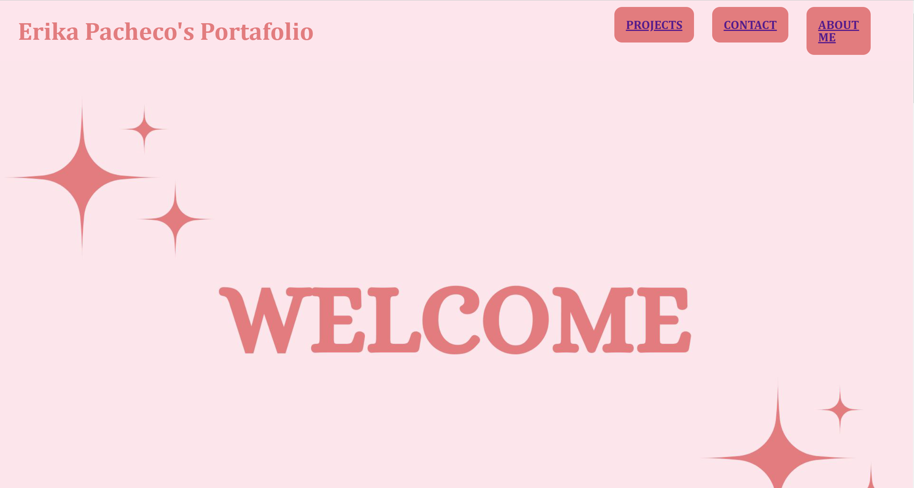
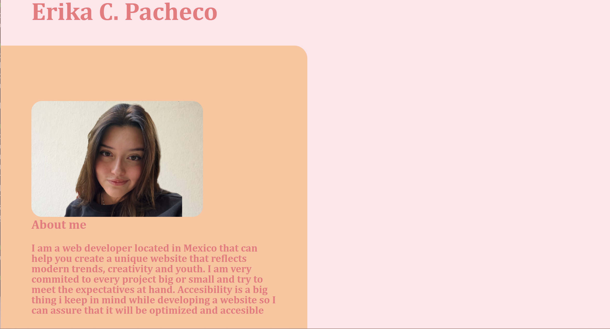
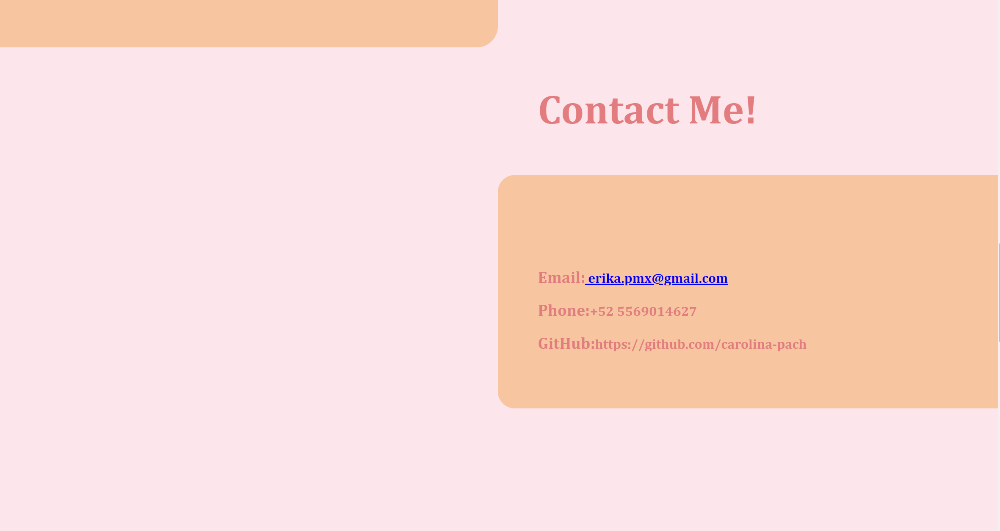
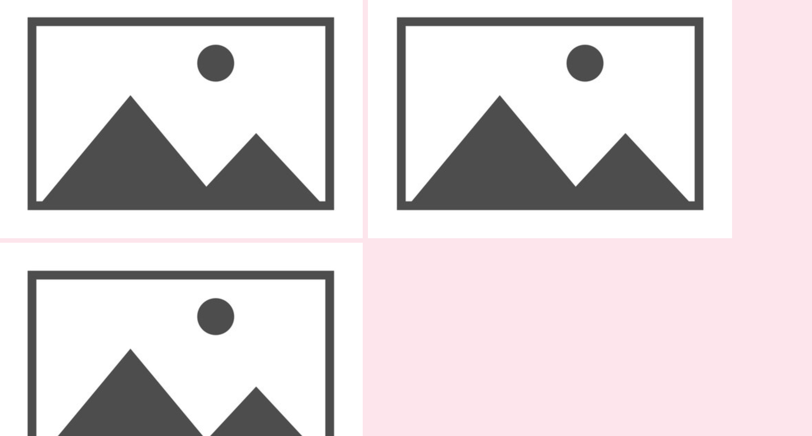

# <My Professional Portafolio>

## Description

Provide a short description explaining the what, why, and how of your project. Use the following questions as a guide:

I build this website to expose my progress and projects in the world of web development. My main inspiration was myself as the website displays the essence of my personality, that is why it includes mainly pink colors. This website is a creative way for other people to dive into my passion and creations. I learned how to master flexbox and the responsiveness of a website.

## Installation

N/A

## Usage

To add a screenshot, create an `assets/images` folder in your repository and upload your screenshot to it. Then, using the relative file path, add it to your README using the following syntax:

## Credits

N/A

## License

MIT
